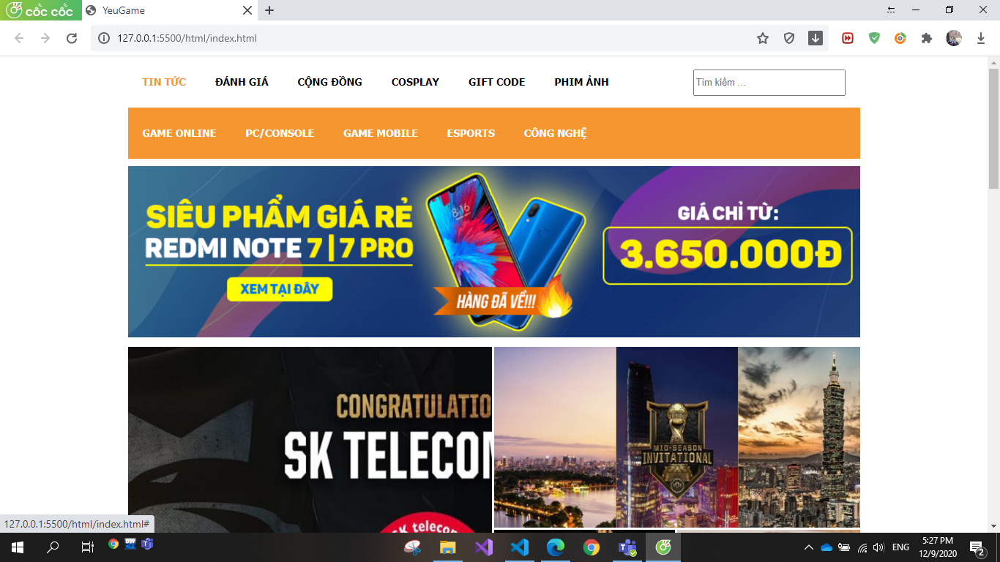
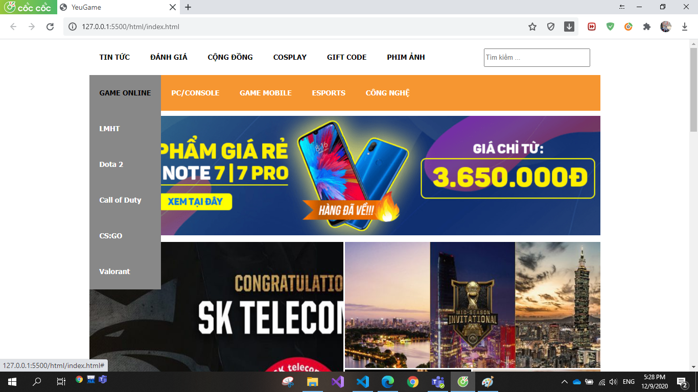
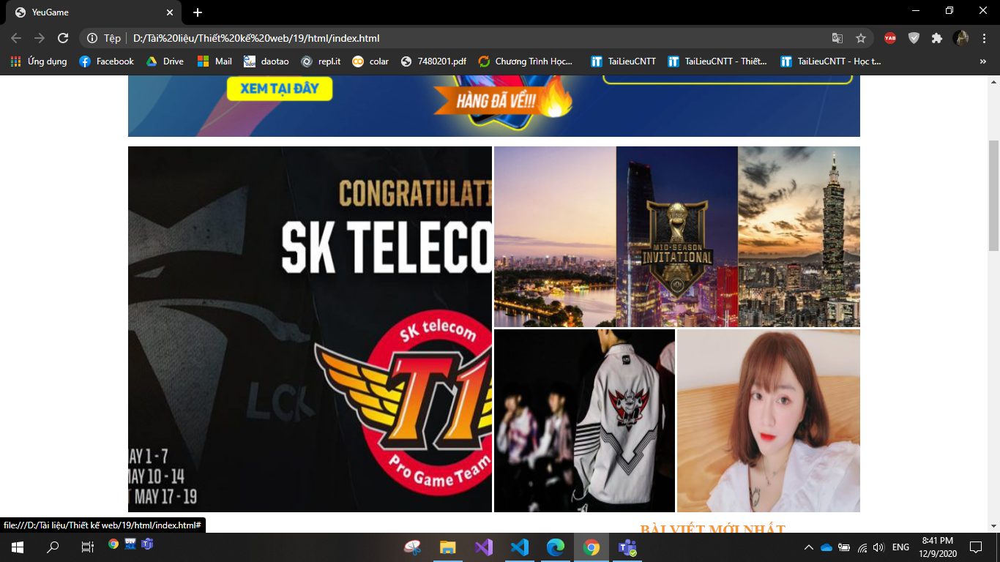
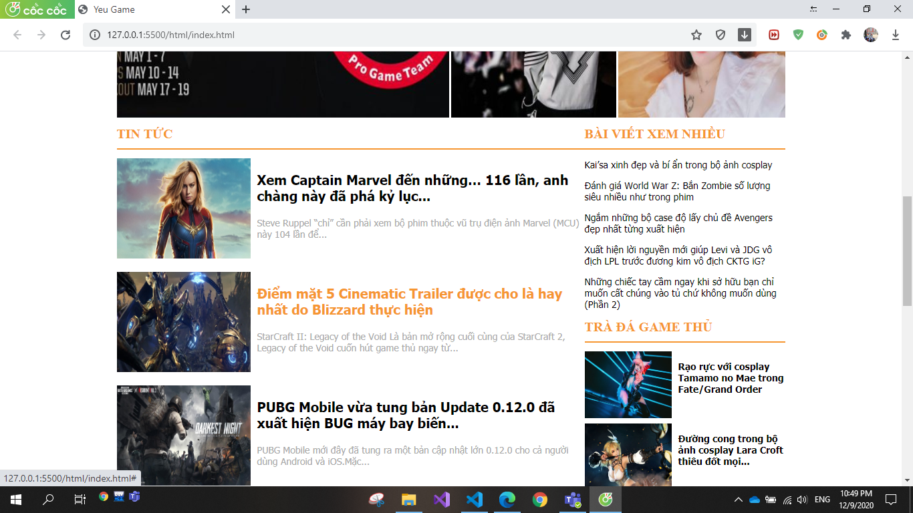
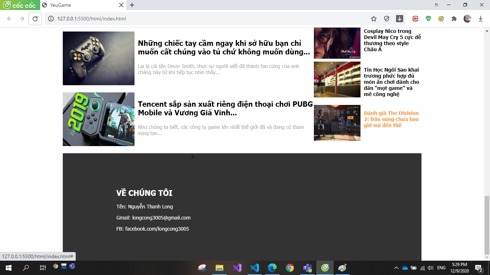

# Báo cáo bài thiết kế web.
## website tin tức về game
#### __Sinh viên: Nguyễn Thanh Long__
#### __MSV: 1821050975__
#### __Lớp: DCCTPM63B__
#### __Học phần: Thiết kế Web_7080211__
#### __Nhóm : 11__
 ## __Đây là trang chủ của website tin tức về game__

*  ## __Phần banner chia làm 2 phần__ 

khi đưa chuột vào các mục của banner, các background sẽ chuyển màu để người dùng biết được là đang chỉ con trỏ chuột vào mục nào.
    ### phần images tiếp theo style để thu phóng khi đưa chuột vào vị trí từng ảnh thì ảnh sẽ nổi lên một mức độ nhất định
    
* ## __Phần content chia làm 3 phần__ 
1. Tin tức câp nhật mới nhất sẽ hiện ở đây 
2. Tin tức được người đọc nhiều nhất
3. Tin tức liên quan đến game

ở phần content này có style thẻ a khi di chuột vào thì dòng tin của bài viết sẽ được chuyển sang màu cam chủ đạo
* ## __Phần footer__
    ### được bố trí đơn giản trên nền đen, chia ra tên các các liên hệ muốn đến với người tạo ra website
    

# __Còn đây là phần code html__
```html
<!DOCTYPE html>
<html>
<head>
	<title>Yeu Game</title>
	<meta charset="utf-8">
	<link rel="stylesheet" type="text/css" href="../css/style.css"/>


</head>
<body>
	<div id="menu_top1">
		<ul>
			<li><a href="#" title="TIN TỨC" class="active1">TIN TỨC</a></li>
			<li><a href="#" title="ĐÁNH GIÁ">ĐÁNH GIÁ</a></li>
			<li><a href="#" title="CỘNG ĐỒNG">CỘNG ĐỒNG</a></li>
			<li><a href="#" title="COSPLAY">COSPLAY</a></li>
			<li><a href="#" title="GIFT CODE">GIFT CODE</a></li>
			<li><a href="#" title="PHIM ẢNH">PHIM ẢNH</a></li>
		</ul>
		<form class="form-group" style="float:right;line-height: 70px;margin-right: 20px;" action="index.html" method="get">
					<input placeholder="Tìm kiếm ..." class="form-control" style="width:200px;height:30px;font-size:13px;" type="text" name="search"/>
		</form>
	</div>
	<div id="menu_top2">
		<ul>
			<li><a href="#" title="GAME ONLINE">GAME ONLINE</a>
				<ul class="sub_menu">
					<li><a href="#">LMHT</a></li>
					<li><a href="#">Dota 2</a></li>
					<li><a href="#">Call of Duty</a></li>
					<li><a href="#">CS:GO</a></li>
					<li><a href="#">Valorant</a></li>
				</ul>
			</li>
			<li><a href="#" title="PC/CONSOLE">PC/CONSOLE</a></li>
			<li><a href="#" title="GAME MOBILE">GAME MOBILE</a>
				<ul class="sub_menu">
					<li><a href="#">Audition X</a></li>
					<li><a href="#">Dragon Raja</a></li>
					<li><a href="#">Free Fire</a></li>
					<li><a href="#">PUPGM</a></li>
					<li><a href="#">Ninja H2</a></li>
				</ul>
			</li>
			<li><a href="#" title="ESPORTS">ESPORTS</a></li>
			<li><a href="#" title="CÔNG NGHỆ">CÔNG NGHỆ</a></li>
		</ul>
		
	</div>
	<div id="banner1">
		
	</div>
	<div class="zoom">
		<div class="z1">
			<a href="#"></a>
		</div>
		<div class="z2">
			<a href="#"></a>
		</div>
		<div class="z3">
			<a href="#"></a>
		</div>
		<div class="z4">
			<a href="#"></a>
		</div>
	</div>
	<div id="main">
		<div id="left">
			<h1 style="font-size:20px;font-family: Time new roman;font-weight:bold;color:#f69631;border-bottom:2px solid #f69631;padding-bottom:10px;">TIN TỨC</h1>
			<ul>
				<li>
					<a href="#">
						
						<h3>Xem Captain Marvel đến những… 116 lần, anh chàng này đã phá kỷ lục...</h3>
					</a>
					<p style="color: #aaa;">Steve Ruppel “chỉ” cần phải xem bộ phim thuộc vũ trụ điện ảnh Marvel (MCU) này 104 lần để...</p>
				</li>
				<li>
					<a href="#">
						
						<h3>Điểm mặt 5 Cinematic Trailer được cho là hay nhất do Blizzard thực hiện</h3>
					</a>
					<p style="color: #aaa;">StarCraft II: Legacy of the Void Là bản mở rộng cuối cùng của StarCraft 2, Legacy of the Void cuốn hút game thủ ngay từ...</p>
				</li>
				<li>
					<a href="3">
						
						<h3>PUBG Mobile vừa tung bản Update 0.12.0 đã xuất hiện BUG máy bay biến...</h3>
					</a>
					<p style="color: #aaa;">PUBG Mobile mới đây đã tung ra một bản cập nhật lớn 0.12.0 cho cả người dùng Android và iOS.Mặc...</p>
				</li>
				<li>
					<a href="#">
						
						<h3>Đấu trường máy tính mùa 5: Sự trở lại hoành tráng của các hãng công nghệ cùng giải đấu...</h3>
					</a>
					<p style="color: #aaa;">Đây là sự kiện thường niên do  INTEL cùng các đối tác công nghệ hàng đầu CORSAIR, GIGABYTE, HP, LENOVO, WESTERN DIGITAL, SAMSUNG, VIEWSONIC, TENDA, THERMALTAKE tổ chức....</p>
				</li>
				<li>
					<a href="#">
						
						<h3>Những kiến thức cơ bản bạn nên biết trước khi đặt chân vào thế giới của tản nhiệt nước...</h3>
					</a>
					<p style="color: #aaa;">Cơ chế hoạt động Khi dàn tản nhiệt nước bắt đầu làm việc, dung dịch làm mát được lưu trữ trong Tank sẽ được Pump...</p>
				</li>
				<li>
					<a href="#">
						
						<h3>Những chiếc tay cầm ngay khi sở hữu bạn chỉ muốn cất chúng vào tủ chứ không muốn dùng...</h3>
					</a>
					<p style="color: #aaa;">Lại là cái tên Devin Smith, thực sự người viết đã thành fan cứng của anh chàng này từ khi tiếp tục nhìn thấy...</p>
				</li>
				<li>
					<a href="#">
						
						<h3>Tencent sắp sản xuất riêng điện thoại chơi PUBG Mobile và Vương Giả Vinh...</h3>
					</a>
					<p style="color: #aaa;">Như chúng ta biết, các công ty game lớn nhất thế giới đã và đang có tham vọng tạo...</p>
				</li>
			</ul>
		</div>
		<div id="right">
			<h1 style="font-size:20px;font-family: time new roman;font-weight:bold;color:#f69631;border-bottom:2px solid #f69631;padding-bottom:10px;">BÀI VIẾT XEM NHIỀU</h1>
			<div class="news">
				<a href="#"><p>Kai’sa xinh đẹp và bí ẩn trong bộ ảnh cosplay</p></a>
				<a href="#"><p>Đánh giá World War Z: Bắn Zombie số lượng siêu nhiều như trong phim</p></a>
				<a href="#"><p>Ngắm những bộ case độ lấy chủ đề Avengers đẹp nhất từng xuất hiện</p></a>
				<a href="#"><p>Xuất hiện lời nguyền mới giúp Levi và JDG vô địch LPL trước đương kim vô địch CKTG iG?</p></a>
				<a href="#"><p>Những chiếc tay cầm ngay khi sở hữu bạn chỉ muốn cất chúng vào tủ chứ không muốn dùng (Phần 2)</p></a>
			</div>
			<h1 style="font-size:20px;font-family: time new roman;font-weight:bold;color:#f69631;border-bottom:2px solid #f69631;padding-bottom:10px; ">TRÀ ĐÁ GAME THỦ</h1>
			<div class="news2">
				<ul>
					<li>
						<a href="#" style="float: left;">
							
							<h3>Rạo rực với cosplay Tamamo no Mae trong Fate/Grand Order</h3>
						</a>
					</li>
					<li>
						<a style="float: left;padding-top: 8px;" href="#">
							
							<h3>Đường cong trong bộ ảnh cosplay Lara Croft thiêu đốt mọi...</h3>
						</a>
					</li>
					<li>
						<a href="#" style="float: left;padding-top: 8px;">
							
							<h3>PUBG Mobile vừa tung bản Update 0.12.0 đã xuất hiện BUG máy bay biến...</h3>
						</a>
					</li>
					<li>
						<a href="#" style="float: left;padding-top: 8px;">
							
							<h3>Ngắm những bộ case độ lấy chủ đề Avengers đẹp nhất từng xuất hiện</h3>
						</a>
					</li>
					<li>
						<a href="#" style="float: left;padding-top: 8px">
							
							<h3>Kai’sa xinh đẹp và bí ẩn trong bộ ảnh cosplay</h3>
						</a>
					</li>
					<li>
						<a href="#" style="float: left;padding-top: 8px">
							
							<h3>Cosplay Nico trong Devil May Cry 5 cực dễ thương theo style Châu Á</h3>
						</a>
					</li>
					<li>
						<a href="#" style="float: left;padding-top: 8px">
							
							<h3>Tin Học Ngôi Sao khai trương phức hợp đủ món ăn chơi dành cho dân “mọt game” và mê công nghệ</h3>
						</a>
					</li>
					<li>
						<a href="#" style="float: left;padding-top: 8px">
							
							<h3>Đánh giá The Division 2: Đấu súng chưa bao giờ vui đến thế</h3>
						</a>
					</li>
				</ul>
			</div>
		</div>
	</div>
	<div id="footer">
		<div class="row">
			<div class="foot_left">
				<h2>VỀ CHÚNG TÔI</h2>
				<p>Tên: Nguyễn Thanh Long</p>
				<p>Gmail: longcong3005@gmail.com</p>
				<p>FB: facebook.com/longcong3005</p>
			</div>
		</div>
	</div>
	
</body>
</html>
``

